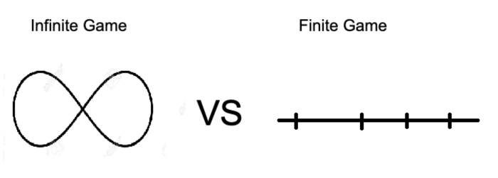

Recently, I read the 14 habits of Good developers by Zeno Rocha. Overall, I thought it was a great book, with some great habits to build to become a great developer. I loved one piece of advice in particular. So I decided to share it.

### **Be Boring**

In the software world, intensity is always praised. If someone spends the whole night programming, everyone around them is impressed. We admire those who go the extra mile to get something done. However, some developers are constantly working late, closer to a deadline. Occasionally, this is fine; sometimes, we need to work hard to meet a deadline or fix a bug in the production. However, if this is frequently happening, then there is a problem.

Who do you think is a better developer? One who is constantly trying to become a better version of themself by putting small, consistent effort or someone who just slacks off until the deadline then go the extra mile to get it done?

What kind of developer should you be? You should be a boring developer who starts and finish their work in a timely fashion. The one who values consistency & discipline over intensity. The one who is playing the infinite game.

### Finite & Infinite Game

In 1986, the philosopher James Carse introduced the concept of two types of games in his book "Finite and Infinite Games: A Vision of Life as Play and Possibility".

A **finite game** has fixed players, rules, and objectives. It has a definite start and end. The goal of it is to win. Sports such as football, card games, board games such as chess, puzzles, and online games such as Counter Strike are finite games. The game is played by a specific set of rules and ends when someone wins.

On the other hand, an **infinite game** is defined as one where the rules are changeable, and the objective is to keep playing. It doesn't terminate because there is no winning. The players loose when they stop playing, which leads to them being replaced by other players. Discipline and Consistency are the keys to playing infinite games. There are no boundaries. James Carse said, "Finite players play within boundaries; infinite players play with boundaries." Programming is an infinite game, and the goal is to keep playing, not to win. The only way to keep playing is to improve oneself by learning new things constantly.

### Advice to play the infinite game

When you change your perspective from playing a finite game to an infinite game, everything changes. You focus on the long-term and overall goal of staying in the game. Here are few things to consider.

- **Invest in your future.** Focus on improving yourself constantly and becoming a better developer. Spend few hours every week learning new things. This will get compounded over the years.
- **Strive for the balance** between your personal life and work. It's about consistency. If you are constantly spending extra hours at work, not only you will risk get burned out but also your personal life will suffer.
- **Build genuine relationships** with your colleagues. Don't network to move up the corporate ladder, but to make real connections to help each other.
- **Do the right thing**. Don't get lost in short-term temporary fixes. Instead, put in the effort to understand it properly so that you can apply your learnings in the future.
- **Be Boring.** Don't be someone who has constant drama in their life. Don't wait for deadlines to motivate you to work hard. Instead, focus on building a great routine and amazing habits which set you up for success in the infinite game of life.